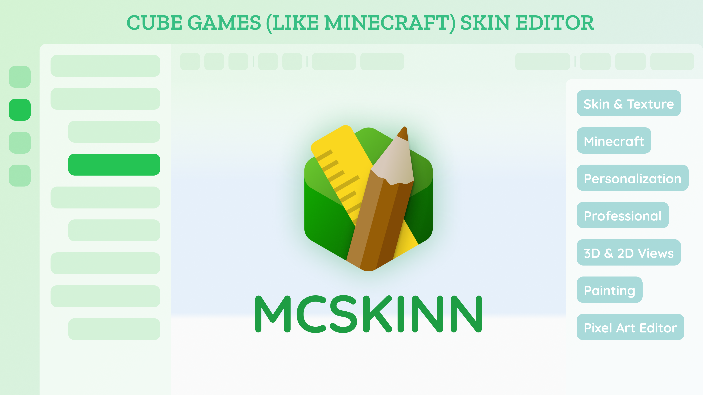

  

☃️ The definitive Skin & Texture Editor for Low-polys (like Minecraft)

<h1 align="center">
  MCSkinn
</h1>

    <a href="https://inkore.net/products/mcskinn/">Official Website</a> | <a href="https://docs.inkore.net/zh-cn/mcskinn/introduction">Documentation</a>

  
  
  
  
  
  

# ✨ Features

- **Design your very own skins for Minecraft**

  One of the keys to Minecraft’s success has to do with the fact that players can customize and modify the environment however they like. Thus, why not do the same with the characters they play with? That’s the function of a program of the likes of MCSkinn, a tool that allows us to create Minecraft skins.

>[!NOTE]
> We also provide various of [tutorials](https://docs.inkore.net/mcskinn/tutorials), [knowledge](https://docs.inkore.net/mcskinn/knowledge) and [tips](https://docs.inkore.net/mcskinn/tips-n-tricks) for you to use in our documentation. Use them flexiblely to create a better authoring environment.

- **Paint all just the way you like the best**

  Unlike other real-time editors, this editor actually lets you paint on the model, as well as the 2d texture map, also providing a neat management facility for all of your installed skins.

- **Organize your wardrobe as well**

  It’s both a skin management and skin editing tool. It holds all of your skins in a convenient place, lets you manage them from within the program.

# 📥 Downloads

- You can download the legacy version through [Microsoft Store](https://www.microsoft.com/store/productId/9N8SJT329HH1?ocid=pdpshare).

  

- The first public test of the new version of MCSkinn has ended, and it cannot be accessed now. Join our community and get latest news as soon as possible!

# 🙋🏻‍♂️ Contribution

- **React us!**

  Give us a star, or follow us, which really encourages us a lot more than you think! Watch this project or join our community to get the latest updates.
  
- **Report issues or give feedback**

  For those who want to request new features or submit bug reports, click [this link](https://github.com/MCSkinn/MCSkinn/issues/new/choose) to open a new issue. Also give us feedback in our community or on Github.

- **Design your skins**

  Create more beautiful skins with MCSkinn Editor and publish them to the public is the easiest support that you can give us.

- **Help with our development**

  If you are an anthusiast and want to support our project, you can help us develop by forking this repo or join us.

# 🫱🏻‍🫲🏻 Sponsorship

Hello! Thank you for using MCSkinn! Do you like it so far?

We have developed MCSkinn for 2 years so far. During the 2-year journey, we spend our time and heart for the project, and at the same time it always completely free, and with no ads.

For this reason you could support us with a voluntary donation. Even a small amount could mean that our work is worth it. Just donate as much as you value our work.

You can sponsor us [here](https://www.inkore.net/donate).

# 🎊 Community

Join our community through [our website](https://www.inkore.net/community). Please remember to read and comply with our community guidelines carefully, and you are welcomed to play an active part with us!
